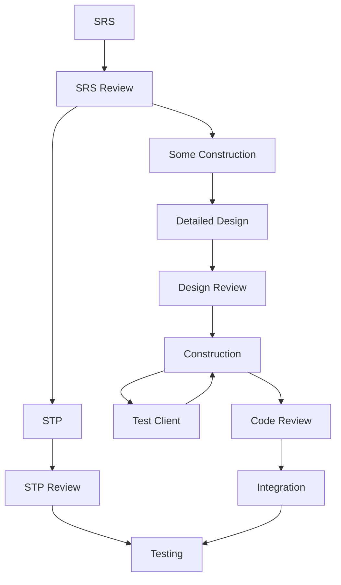

# Service Life Cycle

```mermaid
flowchart TD
    %% Service Life Cycle

    SRS[SRS] --> SRSR[SRS Review]

    %% Left branch
    SRSR --> STP[STP]
    STP --> STPR[STP Review]
    STPR --> TESTING[Testing]

    %% Right branch
    SRSR --> SC[Some Construction]
    SC --> DD[Detailed Design]
    DD --> DR[Design Review]
    DR --> CONSTRUCTION[Construction]

    %% Test client feedback loop
    CONSTRUCTION --> TESTCLIENT[Test Client]
    TESTCLIENT --> CONSTRUCTION

    %% Code review and integration
    CONSTRUCTION --> CODEREVIEW[Code Review]
    CODEREVIEW --> INTEGRATION[Integration]
    INTEGRATION --> TESTING
```
